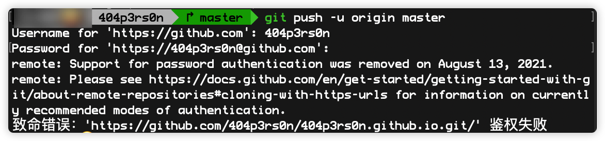
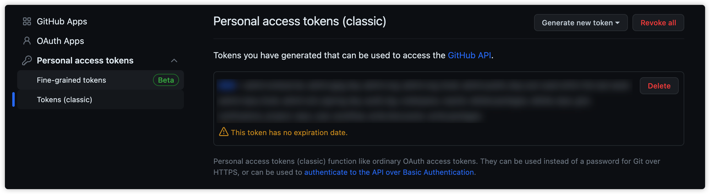

brew一键安装hugo

```bash
brew install hugo
hugo version
```

安装之后创建博客站点

```bash
hugo new site 404p3rs0n
```


创建后下载主题放到themes文件夹下，在hugo.toml中添加主题


或直接指定参数在本地进行测试

```bash
hugo server -t LoveIt --buildDrafts
```

配置成功后，上传github仓库，如果出现鉴权失败



在github中setting中找到Developer setting创建tokens，然后在push的时候输入密码时输入token就可以了


